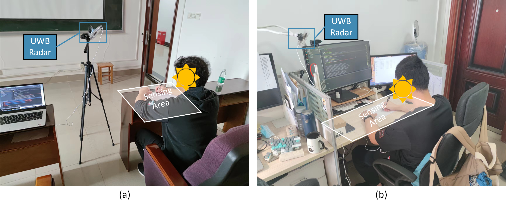

# GeCro-Dataset

## Equipment

## Environment
### Enviroment Info
 Room id  |      Name       |  Room id |  Cool |
------|------------|------|------|
 0 |  Laboratory | 4 | Living-room |
 1 |    Classroom 0   |   5 | Study |
 2 | Classroom 1 |    6 |   Dormitory room |
 3 | Bedroom |     |     |
### Environment Example

## Activity
### Activity Example

