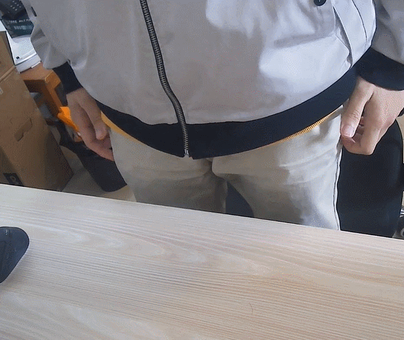

# GeCro-Dataset

## Equipment

## Environment
### Enviroment Info
 Room id  |      Name       |  Room id |  Cool |
------|------------|------|------|
 0 |  Laboratory | 4 | Living-room |
 1 |    Classroom 0   |   5 | Study |
 2 | Classroom 1 |    6 |   Dormitory room |
 3 | Bedroom |     |     |
### Environment Example

## Activity
### Activity Example
<table>
<tr>
    <td></td>
    <td></td>
    <td></td>
</tr>
<tr>
    <td>0_writing</td>
    <td>1_using_mobile_phone</td>
    <td>2_typing</td>
</tr>
<tr>
    <td></td>
    <td></td>
    <td></td>
</tr>
<tr>
    <td>3_flipping_a_book</td>
    <td>4_drinking</td>
    <td>5_lying_on_a_desk</td>
</tr>
<tr>
    <td></td>
    <td></td>
    <td></td>
</tr>
<tr>
    <td>6_raising_hands</td>
    <td>7_standing_up</td>
    <td>8_sitting_down</td>
</tr>
</table>

## Dataset
### Dataset Info
 Name  |      Room id   |  Subject id |  Time |
------|------------|------|------|
 00_211231 |  0 | 0 | 2021/12/31 |
 02_211231 |  0 | 2 | 2021/12/31 |
 03_220105 |  0 | 3 | 2022/01/05 |
 10_220107 |  1 | 0 | 2022/01/07 |
 22_220107 |  2 | 2 | 2022/01/07 |
 30_220120 |  3 | 0 | 2022/01/20 |
 40_220123 |  4 | 0 | 2022/01/23 |
 50_220124 |  5 | 0 | 2022/01/24 |
 62_220402 |  6 | 2 | 2022/04/02 |
 04_220429 |  0 | 4 | 2022/04/29 |
 05_220430 |  0 | 5 | 2022/04/30 |

## Acknowledgements
The authors would like to thank Teng Xiao, Huanhua He, Rongrong Tang, Zhenhong Huang, and Jingtao Shen for their contributions in data collection.
